# Diagrams

Two halves, for two audiences.

**[Part 1](#part-1--the-plain-english-version)** explains what this thing is and
when it will email you, assuming no technical background and no knowledge of
Fantasy Premier League beyond "you pick footballers and get points".

**[Part 2](#part-2--the-technical-version)** is the wiring: AWS resources, the
control flow of a single run, the deployment pipeline and the module layering.

> Diagrams render automatically on GitHub. If you are reading this in a plain
> text editor you will see the Mermaid source instead, which is still readable
> top-to-bottom.

---
---

# Part 1 — the plain-English version

## What it is

Fantasy Premier League is a game where you pick a squad of real footballers and
score points based on how they actually perform each weekend. Before every round
there is a **deadline**, and before that deadline you can swap players in and
out. Choosing well is the whole game.

This is a robot that does the research for you. It watches the official Fantasy
Premier League data plus injury news and betting odds, works out which players
look like good buys, and emails you a ranked shortlist before each deadline.

**It does not play the game for you.** It does not know your team, it cannot make
transfers, and it never touches your account. It reads public information and
sends you an opinion. You decide.

## What it does, start to finish

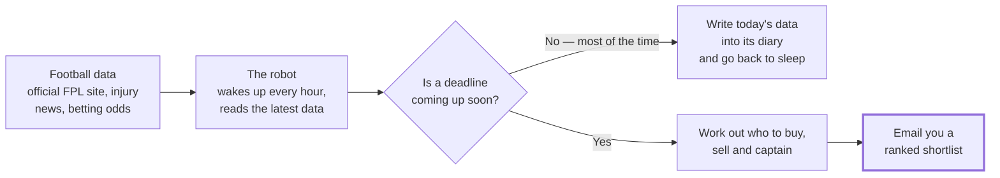

The diary matters more than it looks. Every hour it records what every player
costs and how many people are buying or selling them. That history is how it
later spots a player being quietly dumped by thousands of managers — which is
often the first sign of an injury, hours before any of it is announced.

## When the emails arrive

You get **two emails per deadline**.

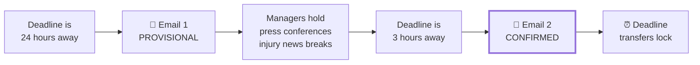

They are deliberately different, and the difference is the point:

| | When | What it is good for |
|---|---|---|
| **Provisional** | 24 hours before | Planning. Prices change overnight, so this is your chance to act early. But some injury news has not broken yet. |
| **Confirmed** | 3 hours before | **The one to act on.** Managers have given their press conferences, so who is actually fit is now known. |

If a player's fitness is still unknown at the time of writing, the email says so
rather than guessing.

## What is in the email

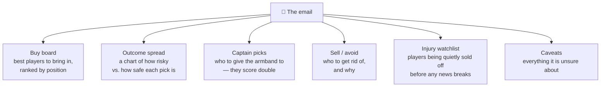

Every recommendation comes with a plain-English reason, a confidence level and a
runner-up. That is deliberate: **the aim is advice you can argue with**, not a
number you have to take on faith.

The last section is the unusual one. Most tools hide their uncertainty; this one
prints it. If a data source was down, or a player's fitness is genuinely unknown,
it says so in the email rather than quietly guessing and sounding confident.

## It marks its own homework

Every time it emails you, it also writes down what it predicted. Once the
football has actually been played it goes back, compares the two, and records how
close it was.

Nothing about that changes the email you get. It exists so that "is this thing
any good?" is a question with an answer, rather than a matter of opinion — and so
that the robot can be improved on evidence rather than on hunches.

## One thing worth understanding

The robot is **not** trying to pick the players who will score the most points.
It is trying to help you **climb the rankings**, which is a subtly different job.

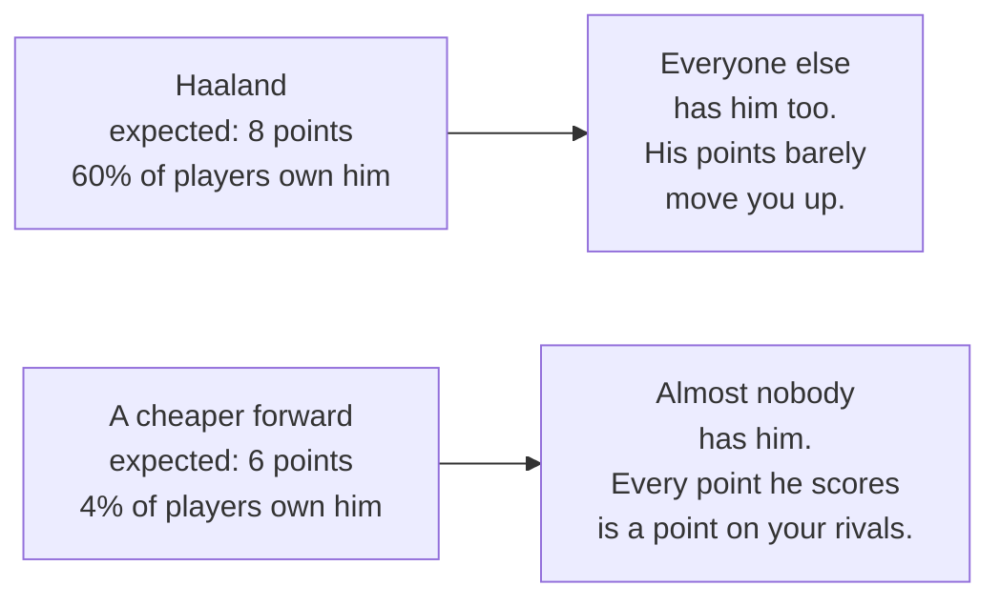

If almost everyone owns a player, his points cancel out — you gain nothing on the
field by owning him, you only *lose* by not owning him. So the robot deliberately
favours good players that few people have picked. This is why its suggestions
sometimes look "wrong" against a plain points ranking. It is not a bug.

## What it costs and where it lives

It runs on rented computing power from Amazon, waking for a few seconds each
hour. It costs roughly **£1.50 a month** — less than a coffee — and there is no
server sitting in anyone's house. If it breaks, it emails about the breakage
rather than going quiet.

---
---

# Part 2 — the technical version

## 2.1 System context

Everything outside the dashed box is somebody else's system. All of it is read
over plain HTTPS with no authentication anywhere — there is no FPL login, no
stored credentials, and no write path to any third party.

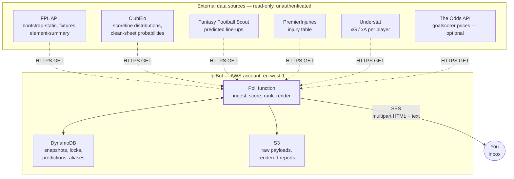

`FPL` is the only **required** source. Every other one is allowed to fail: each
sits behind its own circuit breaker with a last-known-good fallback, and its
absence becomes a named caveat in the email instead of an exception.

## 2.2 AWS resources

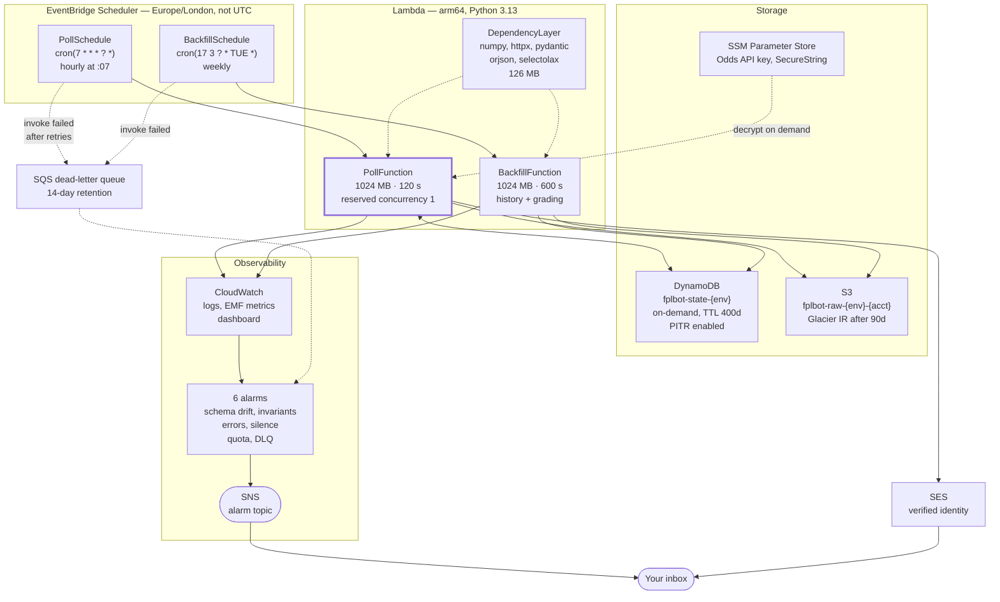

Four choices in there are load-bearing and easy to get wrong:

| Choice | Why |
|---|---|
| **EventBridge Scheduler**, not the legacy Rules API | Scheduler supports a real timezone. The legacy API is UTC-only, so a schedule silently shifts by an hour when the UK changes clocks — twice, mid-season. |
| **Reserved concurrency 1** | A scheduled singleton. Two overlapping runs would both snapshot the same hour and race on the notification lock. |
| **arm64** | ~20% cheaper per GB-second and faster for numpy. Every dependency ships an aarch64 wheel, so there is no compatibility cost. |
| **TTL 400 days**, not 30 | The snapshot series is the only training set for the price model and the only source of intra-gameweek transfer velocity. A short TTL destroys it silently and irreversibly. |

## 2.3 Control flow of one run

The shape that matters: **five cheap gates before any expensive work**. Roughly
730 invocations a month reach step 2 and stop there.

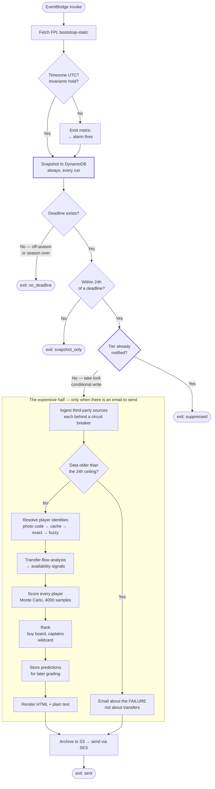

Two details worth pulling out:

**The snapshot happens before every gate.** An hour not snapshotted is lost
forever — unlike the backfill, whose data can be re-fetched retroactively. So it
runs even when the rest of the function is about to exit.

**The lock is a DynamoDB conditional write** keyed on `(season, gameweek, tier)`
and never on wall-clock time. That is what makes Scheduler's at-least-once
delivery safe: a retry has a different timestamp but the same key, so the second
write fails and no duplicate email goes out.

## 2.4 A notifying run, in sequence

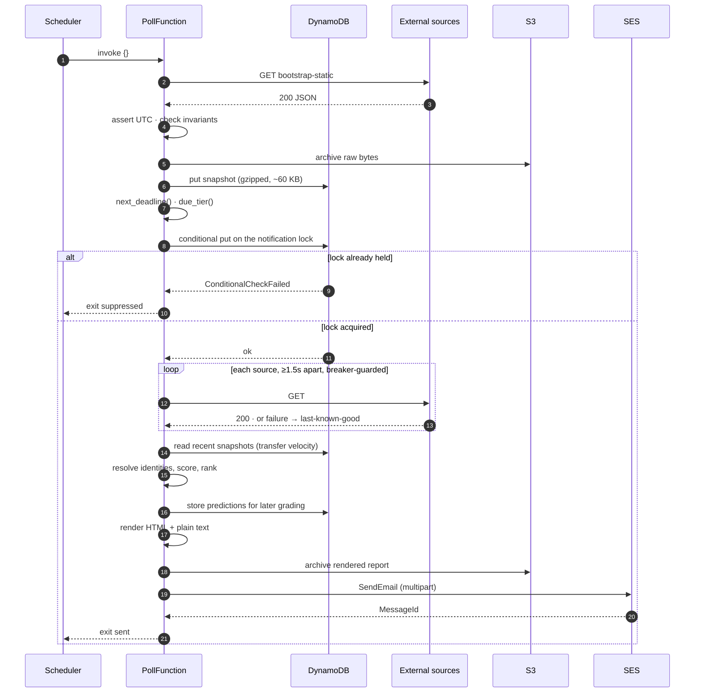

## 2.5 The calibration loop

Every other diagram here shows one run. This one spans two functions and a week,
which is why it needs its own: nothing in a single invocation can tell you
whether the model was any good.

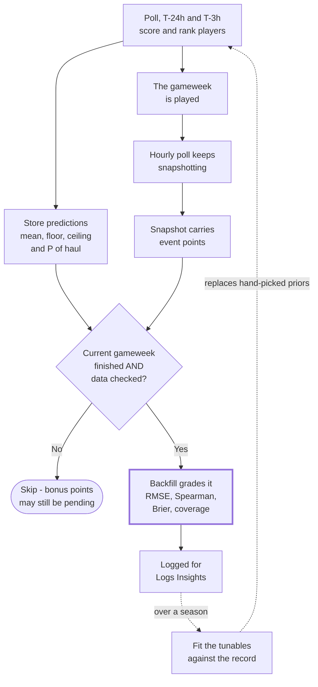

Two things the diagram is making explicit:

**Grading costs no extra HTTP.** The ground truth arrives on a snapshot the poll
was taking anyway. `event_points` is already on the bootstrap, and the hourly
cadence guarantees a settled value is captured — long after the last match, long
before the next deadline resets the field.

**The gate is `data_checked`, not `finished`.** `finished` goes true at the final
whistle, but bonus points land a day or two later, so grading on `finished` alone
would mark every player down by their unawarded bonus. And because `event_points`
holds the *current* gameweek's points, grading the wrong week would compare GW7's
predictions against GW8's scoreline — which looks like a catastrophically bad
model rather than like a bug.

The dashed return arrow is the part that does not exist yet. Every coefficient in
`ModelTunables` is still a hand-picked prior; this loop is what makes replacing
them with fitted values something that can be *evaluated* rather than guessed at.
See [MODEL.md](MODEL.md) section 8.

## 2.6 Module layering

Dependency arrows point one way only. Nothing lower reaches up.

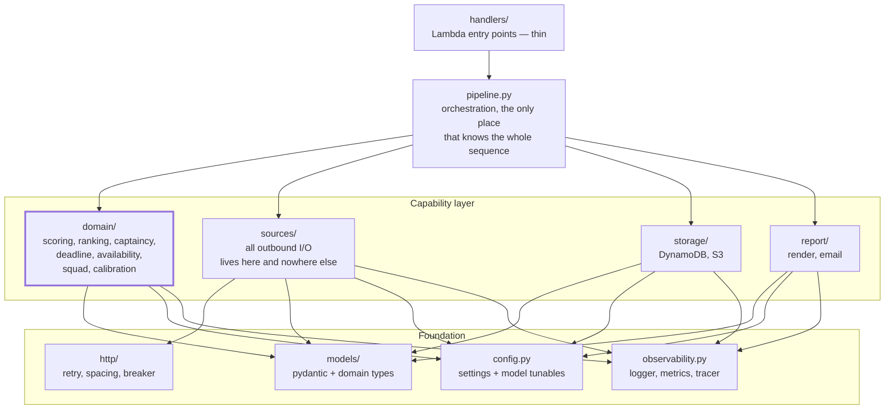

**`domain/` is the boundary that matters.** It is pure: no network, no AWS, no
clock. Every function takes data and returns data, which is why the model can be
tested exhaustively without mocking anything, and why a squad optimiser could be
added later against the same `Distribution` objects without touching ingestion.

**All outbound I/O is in `sources/`.** One place enforces the User-Agent, the
1.5-second per-host spacing, the retry policy and the circuit breaker. A source
that bypassed it would be invisible to every one of those protections.

## 2.7 Deployment

Two CloudFormation stacks, and the separation is deliberate: the pipeline deploys
the application, and is not part of it. If they shared a stack, a broken
application template could put the pipeline that fixes it into `ROLLBACK_FAILED`.

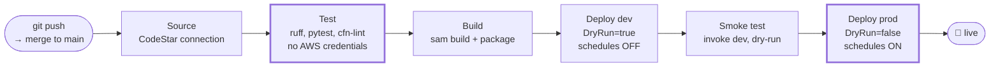

**The Test stage runs with no AWS credentials at all.** That is not an oversight —
it is the strongest available proof that the suite never touches live
infrastructure. A test that grew a dependency on real AWS would fail here,
loudly, rather than passing quietly and burning quota.

**There is no manual approval gate.** A merge reaches production unattended. What
stands between a bad commit and a live bot is the Test stage and the dev smoke
test, and those catch a crash, an import error or a broken template — they do
*not* catch a change that runs perfectly and produces worse advice. That tradeoff
is deliberate and is documented in `pipeline/pipeline.yaml`.

## 2.8 Failure handling

Every external source can fail without taking the run down.

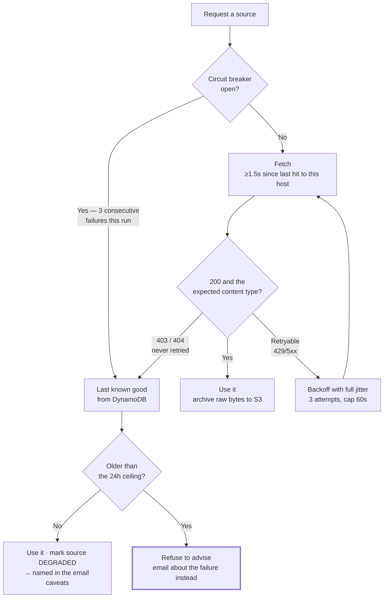

The last box is the important one. Above the staleness ceiling the bot does not
send a worse board — it sends a message saying it could not produce one, and why.
Silence would be worse than either: you would assume it ran and found nothing
worth saying.

Two policies in there are counter-intuitive and deliberate:

- **403 and 404 are never retried.** A 403 is a Cloudflare challenge, and
  hammering it looks like an attack. Understat's 404 means a missing header, and
  no amount of retrying adds one.
- **Redirects are disabled.** During maintenance the FPL API redirects to a page
  that returns **HTTP 200 with an HTML body**. A client that follows redirects
  and checks only the status code gets a parse error at best, and a
  well-formed-looking empty result at worst. The content-type assertion is the
  second half of the same defence.

---

## See also

| Document | What it covers |
|---|---|
| [ARCHITECTURE.md](ARCHITECTURE.md) | The same shape in prose, with more detail per component |
| [DECISIONS.md](DECISIONS.md) | Architecture decision records — the *why* behind each choice |
| [MODEL.md](MODEL.md) | How a player becomes a number, and why it is a distribution |
| [RUNBOOK.md](RUNBOOK.md) | Operating it: alarms, failure modes, what to do at 3am |
